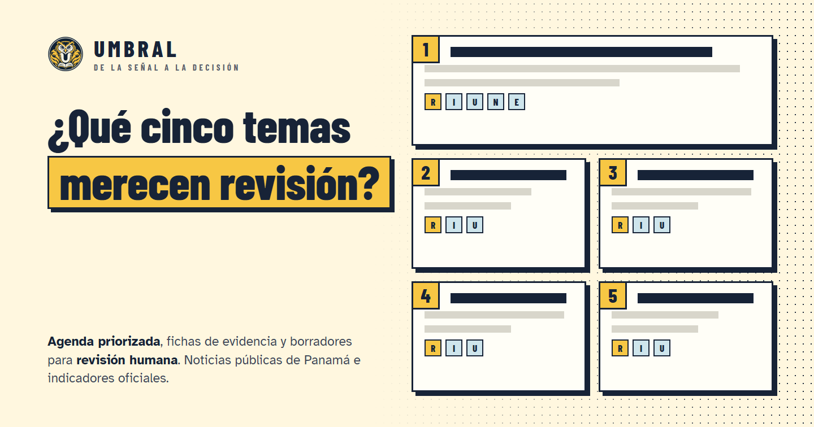
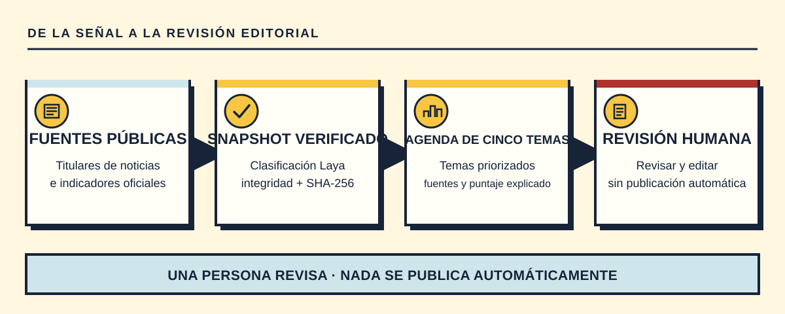
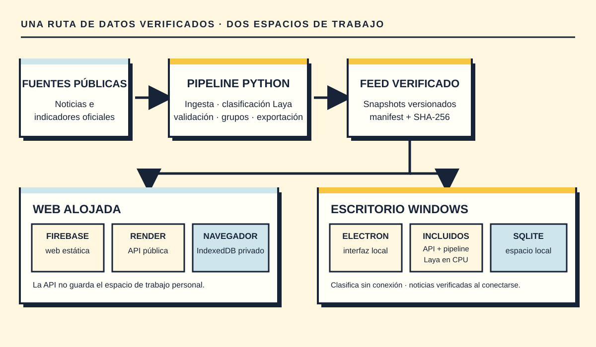

<div align="center">


# Umbral — De la señal a la decisión

**De la señal a la decisión: una agenda priorizada de noticias, con evidencia, para revisión humana.**

[English](README.md) · **Español**

[](https://github.com/Tykillita/Umbral/actions/workflows/ci.yml)
[](https://astro.build)
[](https://react.dev)
[](https://fastapi.tiangolo.com)
[](https://www.python.org)
[](https://nodejs.org)
[](README.md)
[](https://firebase.google.com/products/hosting)
[](LICENSE)

<br>



<p><a href="https://site-umbral.web.app/app">Abrir la app</a> &bull; <a href="#video">Video</a> &bull; <a href="#funciones">Funciones</a> &bull; <a href="#cómo-funciona">Cómo funciona</a> &bull; <a href="#inicio-rápido">Inicio rápido</a> &bull; <a href="#arquitectura">Arquitectura</a> &bull; <a href="#aplicación-de-windows">App de Windows</a> &bull; <a href="#límites-conocidos">Límites conocidos</a> &bull; <a href="SECURITY.md">Política de seguridad</a></p>

<sub>Noticias de Panamá e indicadores oficiales · Interfaz en español · Servicios alojados en planes gratuitos</sub>

</div>

Umbral nace del reto de hackathon de TVN Media *«De la señal a la decisión»* (2026-10-07 a 2026-10-09). Responde a una pregunta: **¿qué cinco temas merecen revisión editorial para la agenda de Panamá y por qué?**

> Todo lo que produce Umbral es un **borrador o una señal para revisión**. Nada se publica automáticamente, aprobar un borrador **no** es publicarlo y el sistema nunca etiqueta una noticia como verdadera o falsa.

La interfaz está en español. El código y los identificadores están en inglés; [el README en inglés](README.md) refleja esta guía.

## Video

https://github.com/user-attachments/assets/a5efe3bc-9854-404e-bb10-0080f941e92f

Recorrido de **77 segundos** por la app real: Agenda, Ficha, Asistente, Borradores, revisión y exportación. Incluye animaciones de cómic, voz en español, subtítulos y clics visibles y audibles. **Activa el sonido** para escuchar la voz, la música y los clics. Las pantallas usan el snapshot real provisional `20261007-e704e952`, en modo local sin conexión; el borrador mostrado es una plantilla con citas.

[Abrir el video](https://github.com/user-attachments/assets/a5efe3bc-9854-404e-bb10-0080f941e92f) · [MP4 del repositorio](docs/video/umbral-tour-es.mp4) · [Subtítulos WebVTT](docs/video/umbral-es.vtt) · [in English](README.md#video)

**Edición para Reels · 1080 × 1920:** [español](https://github.com/user-attachments/assets/16ac484f-ebe9-4cc3-961d-25e1db1b8441) · [English](https://github.com/user-attachments/assets/2d0c072a-097e-4588-9e54-808417ddf845). [Fuentes, reproducción y verificación](docs/public/VIDEO.md).


## Funciones

- **Agenda priorizada.** Un puntaje transparente y versionado (`scoring-v1`): `P = 30R + 25I + 20U + 15N + 10E` (relevancia, impacto, urgencia, novedad y evidencia). Bajo `[0, 40)`, medio `[40, 70)`, alto `[70, 100]`. El estado de evidencia es independiente del puntaje, y las versiones sindicadas de una misma nota cuentan como **una** procedencia.
- **Fichas de evidencia.** Cada tema muestra sus fuentes, indicadores del Banco Mundial, contradicciones, posibles patrocinios y el motivo de cada componente del puntaje. La estructura válida de una cita no demuestra por sí sola que una afirmación esté sustentada.
- **Asistente de evidencia y borradores.** El asistente responde con citas del snapshot verificado y puede abstenerse cuando falta evidencia. Gemini puede redactar opcionalmente una respuesta o un borrador con fuentes desde el servidor; la interfaz identifica el origen y conserva una respuesta basada en reglas o una plantilla con citas si el modelo no está disponible. El límite compartido de Gemini es de 20 llamadas por día UTC, incluidos los reintentos.
- **Espacio privado.** La web alojada no tiene cuentas y la API pública no guarda el trabajo editorial personal. Borradores, versiones, revisiones, notas de impacto y pesos permanecen en el **IndexedDB** del navegador. Exporta o restaura la copia JSON portable, o exporta una ficha a Markdown.
- **Proveedores personales locales.** Una instalación local de web/API o Umbral Desktop puede usar una cuenta conectada de ChatGPT o la sesión del CLI de Claude instalada. Estas conexiones solo funcionan en localhost; la API pública alojada no recibe sesiones personales y Umbral no cambia de proveedor automáticamente.
- **Conectores opcionales de Notion y Slack.** Si se configuran las aplicaciones OAuth, el almacenamiento Firebase y la clave de cifrado, se puede exportar una ficha a Notion, compartirla en Slack y activar avisos de revisión. No están disponibles hasta completar esa configuración del servidor.
- **Clasificación con Laya.** El pipeline usa en CPU el modelo abierto [Laya](https://huggingface.co/convaiinnovations/laya). Umbral Desktop incluye API, pipeline y modelo para reclasificar de forma local; la web consume snapshots ya clasificados y verificados.
- **Actualización verificada de datos.** Un workflow programado prepara candidatos de snapshot y solo publica los que superan controles de integridad y cobertura. La API alojada y Desktop revisan el feed, activan datos verificados y conservan el último snapshot válido si algo falla. La cadencia real de producción aún no está confirmada; consulta [validación](docs/public/VALIDATION.md).
- **Interfaz propia.** Umbral sustituye los controles nativos del navegador por selectores, casillas, campos numéricos, desplegables y ayudas propios, accesibles con teclado. La regla se comprueba con análisis estático y pruebas de extremo a extremo.

## Cómo funciona



## Arquitectura



Más detalle en [docs/public/ARCHITECTURE.md](docs/public/ARCHITECTURE.md). Contratos: [esquema del snapshot](docs/contracts/snapshot-schema.md), [API](docs/contracts/api-draft.md) y [API pública](docs/contracts/api-public.md), además de `apps/api/openapi.json`.

## Estructura del repositorio

```
apps/api/      servicio FastAPI (+ openapi.json)      pipeline/   ingesta, validación, clasificación, agrupación
apps/web/      interfaz Astro + React                 data/       snapshots verificados (sin datos crudos)
apps/desktop/  Electron + instalador NSIS (Windows)   eval/       benchmark de desarrollo y herramientas de métricas
tests/         pruebas de integración y E2E           scripts/    instalación, arranque local, comprobaciones, despliegue
docs/          documentación pública y contratos
```

## Inicio rápido

Necesitas [`uv`](https://docs.astral.sh/uv/) (descarga Python 3.12 sin tocar el de tu sistema) y Node 24. La web declara `node@24` como dependencia de desarrollo, así que no hace falta cambiar tu Node global.

```bash
git clone https://github.com/Tykillita/Umbral.git && cd Umbral
scripts/setup.sh          # Windows: scripts\setup.ps1  (añade --laya / -Laya para instalar el runtime del modelo)
scripts/start-local.sh    # Windows: scripts\start-local.ps1
```

`start-local` compila la web y la sirve junto con la API en <http://localhost:8000> con el snapshot verificado de `data/snapshots/CURRENT`. Con `UMBRAL_OFFLINE=1` (o `--offline` / `-Offline`) se bloquea toda llamada externa.

Para desarrollar usa `scripts/dev.sh` (API en :8000, Astro en :4321).

## Configuración

Solo se versionan los archivos `.env.example`; nunca subas claves reales (`apps/api/.env.example`, `apps/web/.env.example`). Las variables `PUBLIC_*` quedan embebidas en el navegador y no son secretos.

| Variable | Para qué |
|---|---|
| `UMBRAL_AUTH_MODE` | `public` (web alojada, sin cuentas) · `local` (escritorio/desarrollo, un usuario) · `dev-header` (pruebas) |
| `UMBRAL_PERSISTENCE` | `none` (API pública) · `sqlite` (escritorio/local) · `memory` (pruebas) |
| `UMBRAL_OFFLINE` | `1` = sin llamadas externas |
| `GEMINI_API_KEY`, `GEMINI_MODEL` | Nivel gratuito de Gemini, sin facturación; si falla, plantilla |
| `GEMINI_GLOBAL_CALLS_PER_DAY` | Tope global duro (máximo 20 por día UTC, reintentos incluidos) |
| `FIREBASE_PROJECT_ID`, `GOOGLE_APPLICATION_CREDENTIALS` | Credenciales de servidor para el contador de cuota y, si se habilitan, tokens cifrados de conectores |
| `NOTION_OAUTH_*`, `SLACK_OAUTH_*`, `CONNECTOR_ENCRYPTION_KEY` | Conectores OAuth opcionales, solo en servidor; déjalos vacíos para mantener Notion y Slack desactivados |
| `UMBRAL_CORS_ORIGINS`, `UMBRAL_CORS_PREVIEW_PROJECT` | Orígenes web permitidos y canales de vista previa de Firebase |
| `PUBLIC_API_URL`, `PUBLIC_API_MODE`, `PUBLIC_AUTH_MODE` | Compilación web: origen de la API, comportamiento ante errores y modo de acceso |

## Pruebas

```bash
uv run --no-project python scripts/check_repo.py --strict        # secretos y archivos prohibidos
uv run --no-project python scripts/check_public_files.py         # solo archivos publicables, sin rutas personales
uv run --no-project python scripts/check_no_native_ui.py         # regla de controles propios
(cd apps/api && uv run --extra firebase pytest && uv run --extra firebase ruff check . && uv run --extra firebase mypy src \
  && uv run --extra firebase python scripts/export_openapi.py --check)
(cd pipeline && uv run ruff check . && uv run pytest)            # sin red ni PyTorch
(cd apps/web && pnpm install --frozen-lockfile && pnpm check && pnpm test && pnpm build)
scripts/test.sh                                                   # todo, con integración y E2E de Playwright
```

Qué se ejecutó, cuándo y con qué resultado queda en [docs/public/VALIDATION.md](docs/public/VALIDATION.md). Una cita válida en su estructura no prueba que la afirmación esté sustentada, y las pruebas automáticas no sustituyen el juicio editorial humano.

## Despliegue

Cada pull request recibe una vista previa en Firebase Hosting; el workflow de despliegue publica la API en Render, la verifica y luego publica la web en Firebase Hosting. La API alojada es pública y no guarda el espacio de trabajo. El **2026-10-09**, el feed público aún apuntaba al snapshot provisional `20261007-cfa338b6`; la última ejecución programada de datos diarios se omitió, así que no se afirma que las actualizaciones periódicas de producción estén funcionando. El estado alojado, los comandos y el hash del manifest están en [validación](docs/public/VALIDATION.md). Hosting y Render usan planes gratuitos; Gemini permanece dentro de su cuota gratuita configurada. Consulta [detalles de despliegue](docs/public/DEPLOYMENT.md).

## Aplicación de Windows

`apps/desktop` construye un instalador NSIS por usuario para Windows 10/11 x64 que incluye la API, el pipeline, PyTorch CPU y los pesos de Laya; el equipo de destino no necesita Python, Node ni descargar el modelo. Guarda el espacio de trabajo en SQLite local y permite clasificar sin conexión. Mientras esté abierto y conectado, puede buscar y validar noticias cada 24 horas; si un candidato falla, conserva el snapshot anterior. La actualización de la app puede ser automática o limitarse a avisar, según la preferencia de cada persona. El instalador no está firmado, así que Windows puede mostrar un aviso. Ver [apps/desktop](apps/desktop) y [detalles de despliegue](docs/public/DEPLOYMENT.md#windows-app).

## Límites conocidos

- Las salidas se basan en **titulares y metadatos**, no en el texto completo del artículo.
- Las probabilidades del modelo no equivalen a confianza editorial. La clasificación, el sustento de afirmaciones, la agrupación de duplicados y Precision@5 aún requieren **revisión humana**; no se presentan como calidad editorial validada.
- El snapshot alojado es **provisional** hasta recibir el paquete oficial congelado de noticias. El estado del feed y las actualizaciones de producción se fechan en [validación](docs/public/VALIDATION.md).
- La corroboración independiente es escasa en el corpus recolectado; el contenido patrocinado se marca y se limita.
- Render Free puede dormirse tras un periodo sin uso, por lo que la primera petición puede demorarse; la interfaz muestra un estado de preparación y un botón de reintento.
- Este MVP no incluye datos de audiencia, rating ni modalidad bancaria.

## Seguridad

Consulta [SECURITY.md](SECURITY.md) para reportar una vulnerabilidad. Trata el texto de cualquier fuente como dato, nunca como instrucción.

## Licencia

[MIT](LICENSE) © Umbral contributors. Los componentes de terceros conservan sus licencias; la tarjeta y los términos del modelo Laya se incluyen en el instalador de escritorio.
