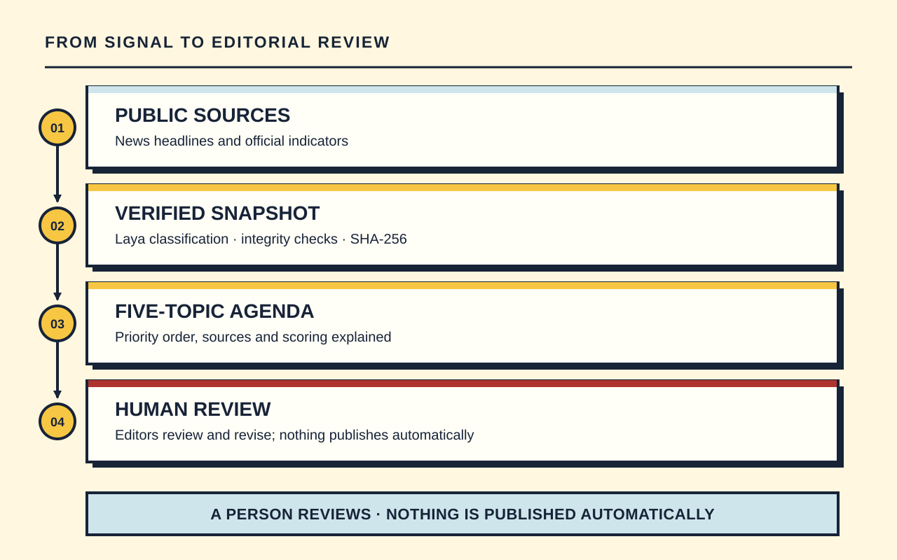
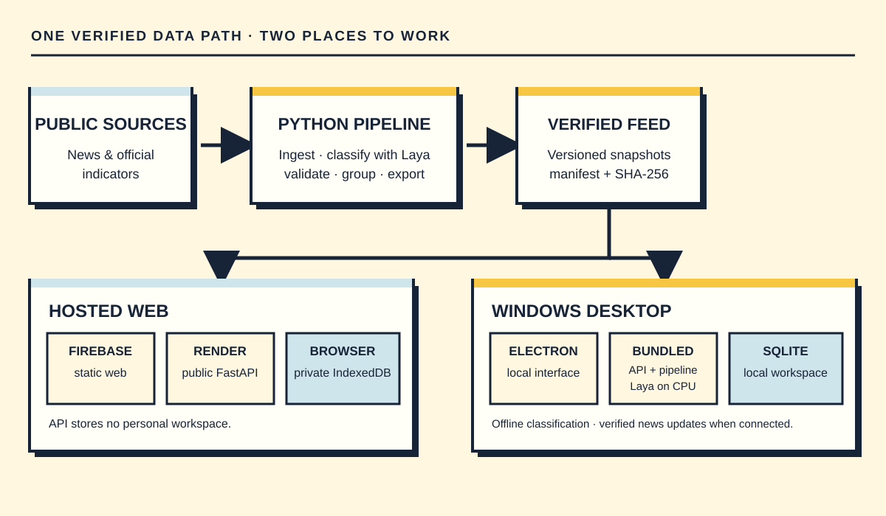

<div align="center">


# Umbral — From signal to decision

**From signal to decision: a prioritised news agenda with evidence, for human review.**

**English** · [Español](README.es.md)

[](https://github.com/Tykillita/Umbral/actions/workflows/ci.yml)
[](https://astro.build)
[](https://react.dev)
[](https://fastapi.tiangolo.com)
[](https://www.python.org)
[](https://nodejs.org)
[](README.es.md)
[](https://firebase.google.com/products/hosting)
[](LICENSE)

<br>


<p><a href="https://site-umbral.web.app/app">Open the app</a> &bull; <a href="#video">Video</a> &bull; <a href="#features">Features</a> &bull; <a href="#how-it-works">How it works</a> &bull; <a href="#quick-start">Quick start</a> &bull; <a href="#architecture">Architecture</a> &bull; <a href="#windows-app">Windows app</a> &bull; <a href="#known-limits">Known limits</a> &bull; <a href="SECURITY.md">Security policy</a></p>

<sub>Panama news and official indicators · Spanish interface · Hosted services use free tiers</sub>

</div>

Umbral was built for the TVN Media hackathon challenge *“From signal to decision”* (2026-10-07 to 2026-10-09). It answers one question: **which five topics deserve editorial review for Panama's agenda, and why?**

> Everything Umbral produces is a **draft or a signal for review**. Nothing is published automatically, approving a draft is **not** publishing it, and the system never labels news as true or false.

The interface is in Spanish. Code and identifiers are in English; [the Spanish README](README.es.md) mirrors this overview.

## Video

https://github.com/user-attachments/assets/b11e44dc-640f-4a29-a3c2-50afb65d22c4

A **77-second** tour of the real app: Agenda, Case Sheet, Assistant, Drafts, review and export. Includes comic animations, English narration, subtitles and visible, audible clicks. The UI remains in Spanish and uses the real provisional snapshot `20261007-e704e952` in offline local mode; the demonstrated draft is a cited template.

[Open the video](https://github.com/user-attachments/assets/b11e44dc-640f-4a29-a3c2-50afb65d22c4) · [Repository MP4](docs/video/umbral-tour-en.mp4) · [WebVTT subtitles](docs/video/umbral-en.vtt) · [en español](README.es.md#video)

**Reels edition · 1080 × 1920:** [English](https://github.com/user-attachments/assets/2d0c072a-097e-4588-9e54-808417ddf845) · [español](https://github.com/user-attachments/assets/16ac484f-ebe9-4cc3-961d-25e1db1b8441). [Sources, reproduction and verification](docs/public/VIDEO.md).


## Features

- **Prioritised agenda.** A transparent, versioned score (`scoring-v1`): `P = 30R + 25I + 20U + 15N + 10E` (relevance, impact, urgency, novelty and evidence). Low `[0, 40)`, medium `[40, 70)`, high `[70, 100]`. Evidence status is independent of the score, and syndicated versions of one report count as **one** provenance.
- **Evidence cards.** Each topic shows its sources, World Bank indicators, contradictions, possible sponsored content and the reason behind each score component. A citation's structure does not by itself prove that a claim is supported.
- **Evidence assistant and drafts.** The assistant answers from the verified snapshot with citations and can abstain when it lacks evidence. Gemini can optionally compose a sourced answer or draft on the server; the UI labels the origin and keeps a cited template or rules-based answer when the model is unavailable. The shared Gemini limit is 20 calls per UTC day, retries included.
- **Private workspace.** The hosted web has no user accounts and the public API does not store personal editorial work. Drafts, versions, reviews, impact notes and weights stay in the browser's **IndexedDB**. Export or restore the portable JSON workspace, or export a case to Markdown.
- **Local personal providers.** A local web/API setup or Umbral Desktop can use a connected ChatGPT account or the installed Claude CLI session. These connections are localhost-only; the hosted public API cannot use personal sessions, and Umbral does not switch providers automatically.
- **Optional Notion and Slack connectors.** When their OAuth applications, Firebase storage and encryption key are configured, users can export a case to Notion, share it in Slack and enable review notices. They are unavailable until that server configuration is supplied.
- **Laya classification.** The pipeline uses the open [Laya](https://huggingface.co/convaiinnovations/laya) model on CPU. Umbral Desktop bundles the API, pipeline and model for local reclassification; the web consumes preclassified, verified snapshots.
- **Verified data updates.** A scheduled workflow prepares snapshot candidates and publishes only those that pass integrity and coverage gates. The hosted API and Desktop check the feed, activate only verified data and retain the last valid snapshot after a failure. The production cadence is not yet confirmed; see [validation](docs/public/VALIDATION.md).
- **A hand-made interface.** Umbral replaces native browser controls with custom, keyboard-accessible selects, checkboxes, number fields, disclosures and tooltips. Static and end-to-end checks enforce this rule.

## How it works



## Architecture



More detail in [docs/public/ARCHITECTURE.md](docs/public/ARCHITECTURE.md). Contracts: [snapshot schema](docs/contracts/snapshot-schema.md), [API](docs/contracts/api-draft.md) and [public API](docs/contracts/api-public.md), plus `apps/api/openapi.json`.

## Repository layout

```
apps/api/      FastAPI service (+ openapi.json)      pipeline/   ingestion, validation, classification, clustering
apps/web/      Astro + React interface               data/       verified snapshots (no raw data)
apps/desktop/  Electron + NSIS installer (Windows)   eval/       development benchmark and metric tools
tests/         integration and end-to-end suites     scripts/    setup, local start, checks, deployment helpers
docs/          public documentation and contracts
```

## Quick start

You need [`uv`](https://docs.astral.sh/uv/) (it fetches Python 3.12 without touching your system Python) and Node 24. The web app declares `node@24` as a dev dependency, so you do not need to change your global Node.

```bash
git clone https://github.com/Tykillita/Umbral.git && cd Umbral
scripts/setup.sh          # Windows: scripts\setup.ps1  (add --laya / -Laya to install the model runtime)
scripts/start-local.sh    # Windows: scripts\start-local.ps1
```

`start-local` builds the web app and serves it, together with the API, at <http://localhost:8000> using the verified snapshot in `data/snapshots/CURRENT`. Add `UMBRAL_OFFLINE=1` (or `--offline` / `-Offline`) to block every external call.

For development run `scripts/dev.sh` (API on :8000, Astro on :4321).

## Configuration

Only `.env.example` files are versioned; never commit real keys (`apps/api/.env.example`, `apps/web/.env.example`). `PUBLIC_*` variables are embedded in the browser bundle and are not secrets.

| Variable | Purpose |
|---|---|
| `UMBRAL_AUTH_MODE` | `public` (hosted web, no accounts) · `local` (single-user desktop/dev) · `dev-header` (tests) |
| `UMBRAL_PERSISTENCE` | `none` (public API) · `sqlite` (desktop/local) · `memory` (tests) |
| `UMBRAL_OFFLINE` | `1` = no external calls |
| `GEMINI_API_KEY`, `GEMINI_MODEL` | Gemini free tier, no billing attached; falls back to a template |
| `GEMINI_GLOBAL_CALLS_PER_DAY` | Hard global cap (max 20 per UTC day, retries included) |
| `FIREBASE_PROJECT_ID`, `GOOGLE_APPLICATION_CREDENTIALS` | Server-side credentials for the quota counter and, when enabled, encrypted connector tokens |
| `NOTION_OAUTH_*`, `SLACK_OAUTH_*`, `CONNECTOR_ENCRYPTION_KEY` | Optional server-only OAuth connectors; leave unset to keep Notion and Slack unavailable |
| `UMBRAL_CORS_ORIGINS`, `UMBRAL_CORS_PREVIEW_PROJECT` | Allowed web origins and Firebase preview channels |
| `PUBLIC_API_URL`, `PUBLIC_API_MODE`, `PUBLIC_AUTH_MODE` | Web build: API origin, error behaviour and auth mode |

## Tests

```bash
uv run --no-project python scripts/check_repo.py --strict        # secrets and forbidden files
uv run --no-project python scripts/check_public_files.py         # only publishable files, no personal paths
uv run --no-project python scripts/check_no_native_ui.py         # custom-controls-only rule
(cd apps/api && uv run --extra firebase pytest && uv run --extra firebase ruff check . && uv run --extra firebase mypy src \
  && uv run --extra firebase python scripts/export_openapi.py --check)
(cd pipeline && uv run ruff check . && uv run pytest)            # no network, no PyTorch
(cd apps/web && pnpm install --frozen-lockfile && pnpm check && pnpm test && pnpm build)
scripts/test.sh                                                   # everything, incl. integration and Playwright E2E
```

What was run, when, and with what result is recorded in [docs/public/VALIDATION.md](docs/public/VALIDATION.md). A syntactically valid citation does not prove that a claim is supported, and automated tests are not a substitute for human editorial judgement.

## Deployment

Pull requests get a Firebase Hosting preview; the deployment workflow deploys the API to Render, verifies it and then publishes the web app to Firebase Hosting. The hosted API is public and stores no user workspace. On **2026-10-09**, the live feed still pointed to provisional snapshot `20261007-cfa338b6`; the latest scheduled daily-data run was skipped, so recurring production refreshes are not claimed. The hosted status, command output and manifest hash are recorded in [validation](docs/public/VALIDATION.md). Hosting and Render use free plans; Gemini stays within its configured free-tier quota. See [deployment details](docs/public/DEPLOYMENT.md).

## Windows app

`apps/desktop` builds a per-user NSIS installer for Windows 10/11 x64 that bundles the API, pipeline, PyTorch CPU and Laya weights; the target machine needs no Python, Node or model download. It stores the workspace in local SQLite and supports offline classification. While open and connected, it can search for and validate news updates every 24 hours, retaining the previous snapshot when a candidate fails. Application updates can be automatic or notification-only, according to the user's setting. The installer is unsigned, so Windows may show a warning. See [apps/desktop](apps/desktop) and [deployment details](docs/public/DEPLOYMENT.md#windows-app).

## Known limits

- Outputs rely on **headlines and metadata**, not full article text.
- Model probabilities are not editorial confidence. Classification, claim support, duplicate grouping and Precision@5 still need **human review**; none is presented as validated editorial quality.
- The hosted snapshot is **provisional** until the official frozen news package is supplied. The current production feed and refresh status are dated in [validation](docs/public/VALIDATION.md).
- Independent corroboration is scarce in the collected corpus; sponsored content is flagged and capped.
- Render Free may sleep after inactivity, so the first request can be delayed; the interface shows a preparation state and a retry button.
- There is no audience, rating or banking-modality data in this MVP.

## Security

See [SECURITY.md](SECURITY.md) to report a vulnerability. Treat the text of any source as data, never as instructions.

## License

[MIT](LICENSE) © Umbral contributors. Third-party components keep their own licenses; the Laya model card and terms are shipped with the desktop installer.
